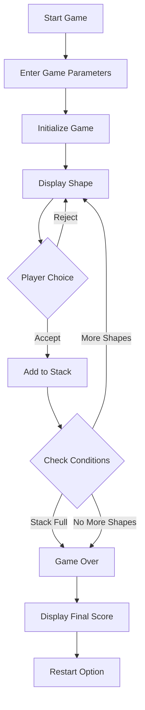
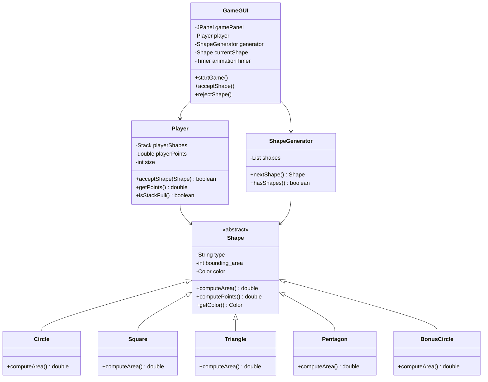
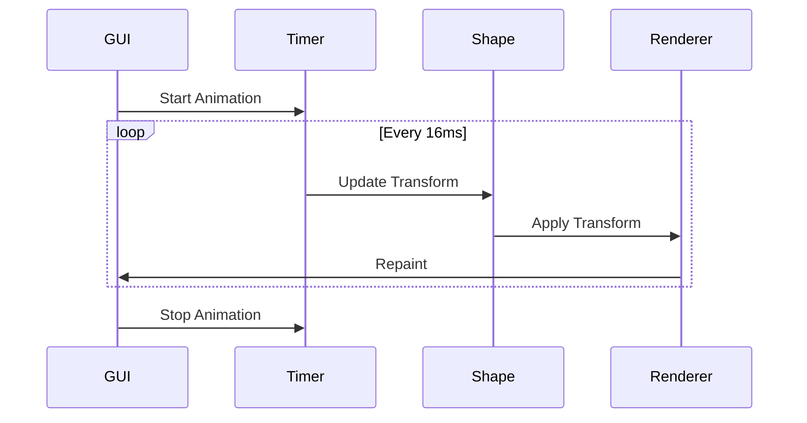
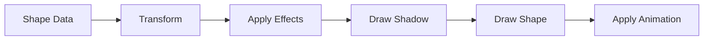

# Shapes Game

An animated Java Swing implementation of a shape collection game with a GUI.

## Attribution

This project is based on the original Shapes Game implementation by [thangiann](https://github.com/thangiann). The core game logic and structure were adapted and enhanced with:
- Modern GUI implementation using Java Swing
- Animation system
- Visual improvements
- Enhanced game mechanics

The original codebase provided the foundation for:
- Shape hierarchy and calculations
- Game logic and scoring system
- Basic game flow
- Player management system

## Game Overview

The Shapes Game is an interactive application where players collect different geometric shapes to score points. Each shape has unique properties and point values based on its area.

### Game Flow



### Class Structure



## Features

### Visual Elements
- Modern, clean interface with a soft color scheme
- Smooth animations and transitions
- Custom-styled buttons with hover effects
- Gradient backgrounds
- Shape shadows and effects
- Responsive layout

### Game Mechanics
1. **Shape Collection**
   - Players collect different geometric shapes
   - Each shape has a unique point value
   - Bonus shapes offer special rewards
   - Stack management is crucial

2. **Scoring System**
   - Points based on shape area
   - Bonus multipliers for special shapes
   - Real-time score updates
   - Final score summary

3. **Game Controls**
   - Start/Restart game
   - Accept/Reject shapes
   - Stack management
   - Game parameter configuration

### Technical Implementation

#### Animation System


#### Shape Rendering Pipeline


## Installation and Running

1. **Prerequisites**
   - Java Development Kit (JDK) 8 or higher
   - Any Java IDE (optional)

2. **Compilation**
   ```bash
   javac *.java
   ```

3. **Execution**
   ```bash
   java GameGUI
   ```

## Game Parameters

- **Shapes per Type**: Number of each shape type in the game
- **Stack Size**: Maximum number of shapes a player can collect
- **Default Values**:
  - Shapes per Type: 5
  - Stack Size: 10

## Code Structure

### Key Classes

1. **GameGUI.java**
   - Main game window and interface
   - Handles user input and game flow
   - Manages animations and rendering
   - Implements modern UI elements

2. **Shape.java**
   - Abstract base class for all shapes
   - Defines common properties and methods
   - Handles color generation and point calculation

3. **Player.java**
   - Manages player's shape collection
   - Tracks score and stack status
   - Handles shape acceptance logic

4. **ShapeGenerator.java**
   - Creates and manages available shapes
   - Controls shape distribution
   - Handles game progression

### Design Patterns Used

1. **Observer Pattern**
   - GUI updates based on game state changes
   - Score and stack display updates

2. **Factory Pattern**
   - Shape generation and management
   - Dynamic shape creation

3. **State Pattern**
   - Game state management
   - Animation state handling

## Future Improvements

1. **Planned Features**
   - High score system
   - Multiple difficulty levels
   - Sound effects
   - More shape types
   - Power-ups

2. **Technical Enhancements**
   - Save/Load game state
   - Network multiplayer
   - Custom themes
   - Performance optimizations

## Contributing

Feel free to contribute to this project by:
1. Forking the repository
2. Creating a feature branch
3. Submitting a pull request

---
## Author
John Morfidis